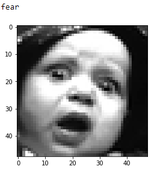

# face-emotions
This is a model trained on the kaggle competition -"Challenges in Representation Learning: Facial Expression Recognition Challenge"
The data can be downloaded from the following link
https://www.kaggle.com/c/challenges-in-representation-learning-facial-expression-recognition-challenge/data

The inputs to the model are 48x48 size grayscale images. The outputs are 7 distinct emotions categorized into  (Angry, Disgust, Fear, Happy, Sad, Surprise, Neutral).

Some of the sample images and their labels are here.

   

All the images are normalized and fed into a CNN model in Keras.

The model is a simple CNN with three convolutional layers followed by two Densely connected layers.
The model achieves an accuracy of 60% with a validation around 55%.

Some of the predicted classes and expected classes have been shown below.

   
